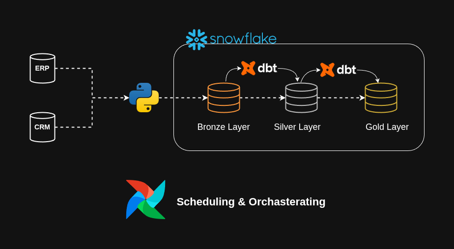
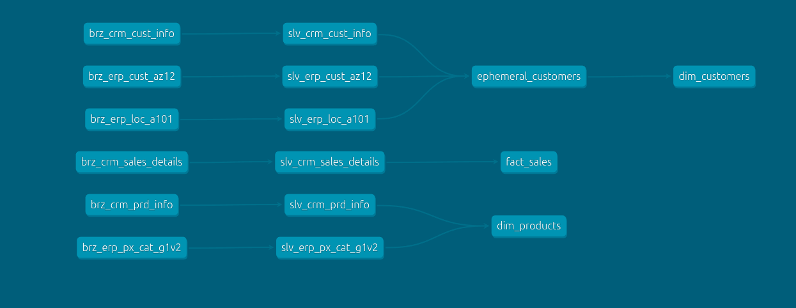
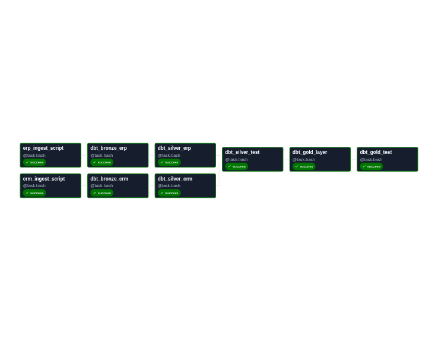

# Sales Data Pipeline — ERP & CRM to Data Warehouse

A data pipeline that ingests raw data from ERP and CRM source systems, transforms it through a Medallion Architecture (Bronze → Silver → Gold), and delivers a Star Schema Sales Data Mart in Snowflake — orchestrated end-to-end with Apache Airflow.

Key design principles:
- **Incremental Loading** — only new or changed records are processed on each pipeline run, minimizing compute cost and load time
- **SCD Type 2** — full history of changes is preserved on dimension table

---

## Architecture Overview

Data is extracted from two source systems — an **ERP** and a **CRM** — via Python ingestion scripts. Once landed in Snowflake's Bronze layer, **dbt** handles all transformations through to the Gold layer. Dimension tables in the Gold layer implement **SCD Type 2** to track full historical changes. Apache Airflow schedules and orchestrates the entire pipeline.

---

## Data Layers

The pipeline follows the **Medallion Architecture** with three layers inside Snowflake:

### 🥉 Bronze Layer — Raw Ingestion
Raw data landed as-is from source systems with no transformations. Tables are prefixed `brz_`.

### 🥈 Silver Layer — Cleaned & Conformed
Data is cleaned, typed, and standardized. Tables are prefixed `slv_`.

### 🥇 Gold Layer — Business-Ready Data Mart
Dimensional models ready for analytics and reporting.

--- 

## Data Lineage
The lineage flows from Bronze → Silver → Gold:

---

## Data Mart Schema
 
The Gold layer implements a **Star Schema** Sales Data Mart:

---
## Airflow DAG
 
The pipeline is orchestrated as a single Airflow DAG with the following task sequence:

